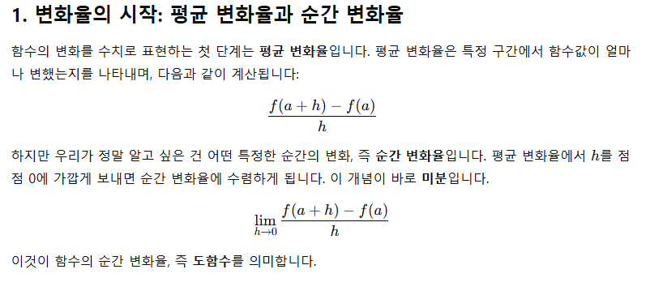
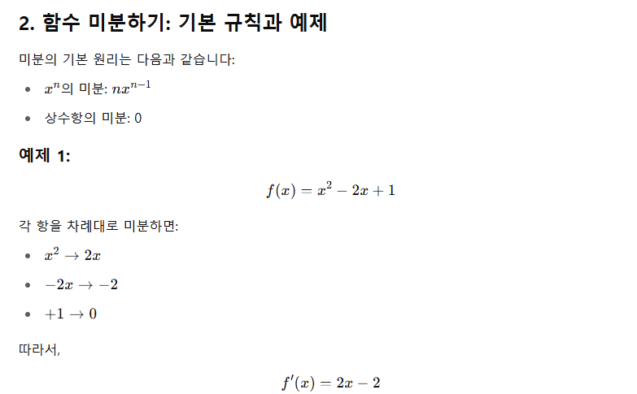
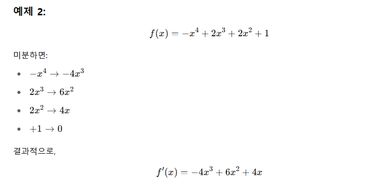
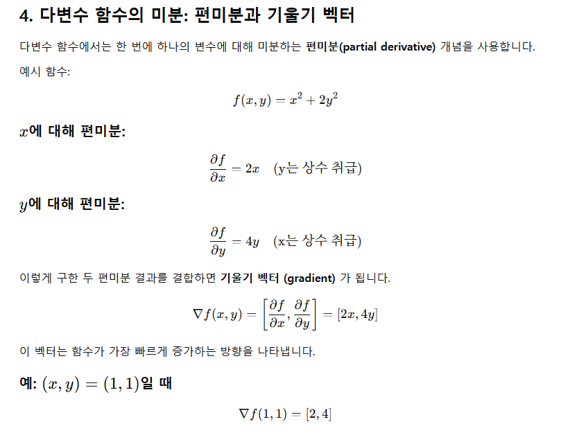

함수의 기울기를 통해 그래프의 형태를 이해할 수 있습니다.

극소점(local minimum): 기울기가 음수에서 양수로 바뀌는 지점

극대점(local maximum): 기울기가 양수에서 음수로 바뀌는 지점

안장점(saddle point): 기울기는 0이지만 극대/극소가 아닌 지점 (예: 위로도 아래로도 오르막인 방향 존재)

함수의 미분이 0인 지점은 그래프의 특징적인 변곡점이 될 수 있으며, 이때 2차 미분을 통해 구체적인 성질을 분석할 수 있습니다.

***왜 머신러닝에서 미분이 중요한가?***
머신러닝에서는 비용 함수(cost function) 를 최소화하는 방향으로 학습이 진행됩니다. 이때 미분을 통해 기울기를 구하고, 그 방향을 따라 최적점을 찾아가는 방식이 경사 하강법(Gradient Descent) 입니다.

즉, 미분은 다음과 같은 역할을 합니다:

오차를 줄이는 방향(기울기)을 계산

파라미터(모델의 설정값)를 조금씩 조정

반복적으로 최적화하여 학습을 완성